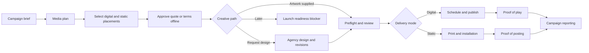

# EasyAD Development Plan: Digital and Static OOH

Status: phases 0–6 implemented behind server-owned feature flags; phase 7 deferred  
Last updated: 2026-08-24  
Primary audience: Codex, Claude, and human contributors  
Target market: Northern Ontario first, Canada-ready  

## 1. Purpose

Evolve EasyAD from a collection of single-placement MVP workspaces into an end-to-end outdoor advertising platform for:

- local advertisers planning their own campaigns;
- local advertising agencies planning campaigns for multiple clients;
- agency designers receiving briefs, delivering proofs, and managing revisions;
- media owners and operators managing both digital and non-digital inventory;
- production and installation teams fulfilling static billboard campaigns;
- institutions and local governments operating owned digital screens;
- Super Admins overseeing permissions, inventory, approvals, and platform health.

The current development target must support digital and static outdoor advertising without requiring online payment. The architecture must preserve a clean future path to quotes, invoices, hosted checkout, refunds, and operator payouts.

This is an incremental migration plan. Do not rewrite the application all at once.

## 2. Product decision summary

### Build now

- A real `Campaign` that owns one or more `Placements`.
- Mixed campaigns containing digital and static placements.
- Organization and client context for local agencies.
- A guided media-planning workflow with shortlist, comparison, and combined estimates.
- Optional creative paths: provide artwork, request agency design, or add artwork later.
- Versioned design briefs, files, proofs, comments, change requests, and approvals.
- Static production, installation scheduling, and proof-of-posting workflow.
- Digital scheduling and proof-of-play as a separate fulfillment workflow.
- Quote preparation and offline commercial approval without collecting payment.
- Role- and organization-scoped permissions, audit history, notifications, and recovery states.
- English and Canadian French support following the existing locale contract.

### Prepare now, activate later

- Provider-neutral payment boundaries and immutable money snapshots.
- Invoice, refund, tax, and payout concepts.
- External print-vendor, installation-vendor, CRM, accounting, and media-player integrations.
- Automated reach/frequency feeds and audited inventory imports.

### Do not build in the current scope

- Card collection or a production payment gateway.
- Automatic submission of municipal or provincial sign-permit applications.
- Claims that the platform provides legal or regulatory approval.
- Fully automatic creative approval.
- AI-generated campaign plans or artwork before the structured human workflow is reliable.
- A big-bang replacement of the existing booking, institution, or public-device workflows.

## 3. Agent execution contract

Every Codex or Claude implementation task must follow these rules:

1. Read this plan, `DESIGN.md`, `UX-CONTRACT.md`, `README.md`, `database/schema.sql`, and the relevant API/component tests before editing.
2. Inspect `git status` and preserve all existing user work. The repository may already be dirty.
3. Implement one phase or one vertical slice at a time. Each slice must work from database to API to UI to tests.
4. Use additive, idempotent database migrations. Do not rename or remove legacy fields until data is backfilled, consumers are migrated, and rollback is documented.
5. Preserve the existing `institutional` role and government workspace behavior.
6. Do not hard-code one universal static-art specification. Each inventory face owns a versioned production specification.
7. Do not use digital terms for static fulfillment. Static faces have production and installation states; digital screens have scheduling and playback states.
8. Keep high-risk actions pessimistic. Never claim a reservation, approval, installation, publication, or payment succeeded before the server confirms it.
9. Do not expose payment controls while payments are out of scope. The existing mock charge/refund route must not become a production dependency.
10. Update `UX-CONTRACT.md` whenever shared lifecycle, permission, navigation, feedback, or recovery behavior changes. Update `DESIGN.md` only for durable visual-system changes.
11. Add English-source i18n messages for all owned UI. Add or update Canadian-French coverage; require native French review before production release.
12. Meet WCAG 2.2 AA: semantic controls, visible focus, keyboard support, text-equivalent status, accessible dialogs, stable layouts, and non-drag alternatives.
13. Do not mark a phase complete until its acceptance criteria and verification commands pass.

## 4. Product language

Use these terms consistently:

| Term | Meaning |
|---|---|
| Inventory unit | A sellable OOH location or face. Use this shared term in data and mixed-format views. |
| Digital screen | An inventory unit that renders scheduled files and produces playback evidence. |
| Static face | A non-digital inventory unit that displays printed material and produces installation evidence. |
| Campaign | The advertiser/client objective, dates, budget, creative work, and combined results. |
| Placement | One campaign's reservation on one inventory unit for a defined period. |
| Media plan | A draft or proposed group of placements with estimates and commercial terms. |
| Creative asset | Reusable source artwork or media. |
| Creative version | An immutable revision of an asset or proof. |
| Design request | A request for an agency designer to create or adapt artwork. |
| Production job | The print/fabrication work required for a static placement. |
| Installation work order | The scheduled physical posting or removal task. |
| Proof of play | Evidence that digital content was rendered. |
| Proof of posting | Evidence that static artwork was installed. |
| Quote | Proposed commercial terms. It is not a payment or invoice. |

Avoid using `device` for every static face in customer-facing copy. Existing internal identifiers may keep `inventoryId` during migration.

## 5. Target workflow



### 5.1 Advertiser or agency planning

1. Create a campaign brief.
2. If working as an agency, select or create the client and brand.
3. Enter objective, geography, dates, budget range, target audience, message, and required languages.
4. Search the map and inventory list.
5. Add multiple units to a media-plan tray without immediately booking them.
6. Compare format, delivery mode, availability, media rate, estimated circulation/impressions, production lead time, and additional estimated costs.
7. Apply dates or campaign cycles in bulk, then resolve unit-specific conflicts.
8. Save a draft, share it with authorized collaborators, or submit it for operator confirmation.
9. Approve the resulting quote/terms offline. No payment prompt appears.

### 5.2 Creative intake choices

At placement or compatible-placement-group level, offer three explicit paths:

- `Upload finished artwork`
- `Request design from agency`
- `Add creative later`

The third option creates a visible launch-readiness blocker and due date. It must not silently advance the placement to ready.

### 5.3 Agency design service

1. Planner sends a design request containing campaign context and placement specifications.
2. Designer receives a work queue with priority, owner, due date, and blocked/missing information.
3. Designer reviews the brief, brand files, copy, logo, images, CTA, required disclaimers, language, and examples.
4. Designer uploads an immutable proof version.
5. Client reviews the exact version, comments, and either requests changes or approves it.
6. Each change request creates a new revision round; approved versions are never overwritten.
7. Operator performs technical/placement review separately from client approval.
8. The approved production master is locked and assigned to compatible placements.

### 5.4 Static billboard fulfillment

Static inventory must follow this workflow:

1. **Specification snapshot** — copy the inventory unit's current production specification onto the placement so later spec edits cannot change an approved job silently.
2. **Artwork preflight** — validate what can be validated safely and display a manual checklist for the rest.
3. **Client approval** — record the exact creative version, approver, timestamp, and optional approval note.
4. **Operator approval** — confirm artwork fit, content acceptability, site constraints, and production readiness.
5. **Production job** — record print vendor, substrate, quantity, finishing, target completion, shipment/delivery, and status.
6. **Installation work order** — record unit, artwork version, planned posting date, crew/vendor, access notes, removal date, and operational instructions.
7. **Installation completion** — field staff upload one or more completion photos and record completion time, result, and any issue.
8. **Proof of posting** — publish authorized proof photos and certification to the campaign timeline.
9. **Issue handling** — support weather delay, access blocked, damaged material, partial completion, reprint required, and reschedule.
10. **Removal** — schedule removal or replacement and retain a final audit event.

Static placements are `live` only after installation is confirmed. They do not create playback logs.

### 5.5 Digital fulfillment

Digital inventory keeps a distinct path:

1. Validate pixel dimensions, aspect ratio, file type, file size, duration, and device-specific rules.
2. Record client and operator approval on an immutable creative version.
3. Assign the version to one or more compatible placements.
4. Schedule delivery.
5. Receive player events through an idempotent ingestion boundary.
6. Distinguish scheduled, delivered, missed, late, and unverifiable playback.
7. Aggregate proof of play without deleting raw events.

The existing manual `Run delivery tick` remains demo-only and must be clearly isolated before production proof-of-play work begins.

### 5.6 Mixed campaigns

A campaign may contain both delivery modes. The campaign readiness view must group blockers by placement:

- static placement waiting for design approval;
- static placement waiting for print or installation;
- digital placement waiting for technical approval;
- digital placement scheduled or live.

Campaign-level status is a summary, not a replacement for placement-level truth.

## 6. Roles, organizations, and permissions

Do not solve agency support by adding many global user roles. Add organization membership and capability checks while preserving the current role enum during migration.

### 6.1 Organization types

- `advertiser`
- `agency`
- `media_owner`
- `institution`
- `production_vendor` (later UI; schema may be prepared)
- `installation_vendor` (later UI; schema may be prepared)

### 6.2 Membership roles

- `owner`
- `admin`
- `planner`
- `account_manager`
- `designer`
- `reviewer`
- `operations`
- `finance`
- `viewer`

### 6.3 Initial capability examples

| Capability | Typical members |
|---|---|
| Manage organization members | owner, admin |
| Manage clients/brands | agency owner, admin, account manager |
| Create media plans | planner, account manager |
| Upload or create artwork | designer, planner |
| Approve client creative | advertiser reviewer, authorized agency reviewer |
| Approve inventory/technical fit | media-owner operations, institutional owner, Super Admin |
| Manage production/install work | operations, assigned vendor member |
| View commercial terms | owner, admin, planner, finance, explicitly authorized client reviewer |
| Change permissions | owner, admin only |

All API routes must resolve organization scope server-side. UI visibility is not authorization.

### 6.4 Agency/client relationship

An agency can manage multiple client records without requiring every client to sign in. A client may later be invited as a member or reviewer. Access must be explicit and revocable.

Do not create public approval links in the first implementation slice. If secure external review links are added later, they require expiring, single-purpose tokens, revocation, audit logging, and protection against indexing or token leakage.

## 7. Domain model

The following is the target model. Field names may change after an ADR, but entity boundaries must remain.

### 7.1 Organizations and brands

#### `organizations`

- `id`
- `name`
- `type`
- `status`
- `default_currency` (`CAD` initially)
- `timezone`
- `created_at`, `updated_at`

#### `organization_memberships`

- `organization_id`
- `user_id`
- `membership_role`
- `status`
- `created_at`, `updated_at`
- unique `(organization_id, user_id)`

#### `agency_clients`

- `id`
- `agency_organization_id`
- `client_organization_id` nullable
- `display_name`
- `status`
- `primary_contact` fields with an explicit privacy/retention decision
- `created_at`, `updated_at`

#### `brands`

- `id`
- `owner_organization_id` or `agency_client_id`
- `name`
- `brand_notes`
- `created_at`, `updated_at`

### 7.2 Inventory and versioned specifications

Extend `inventory` additively:

- `delivery_mode`: `digital | static`
- `product_type`: `billboard | poster | transit_shelter | transit_vehicle | mural | place_based | other`
- `orientation`: `landscape | portrait | custom`
- real latitude/longitude fields for future production use; keep existing `x/y` demo coordinates during migration
- `facing_direction`
- `illumination`: `none | front_lit | back_lit | digital`
- `availability_status`
- `booking_lead_days`
- `production_lead_days`
- `installation_lead_days`
- `measurement_source`
- `measurement_value`
- `measurement_period`
- `measurement_updated_at`
- `measurement_method`: `estimated | operator_reported | audited`

Add `inventory_spec_versions`:

- `id`, `inventory_id`, `version`
- physical width/height and units
- art scale
- required colour space
- minimum effective DPI
- bleed and safe-area values
- accepted file types and maximum size
- substrate/finishing notes
- digital-only pixel/duration/codec fields when applicable
- template file reference
- operator notes
- `effective_from`, `retired_at`
- `created_by`, `created_at`

Never assume that all static billboards share one ratio, material, scale, or colour requirement.

### 7.3 Campaigns and placements

#### `campaigns`

- `id`
- `owner_organization_id`
- `agency_client_id` nullable
- `brand_id` nullable
- `name`
- `objective`
- `start_date`, `end_date`
- `budget_amount_minor` nullable
- `currency`
- `status`
- `created_by`
- `version` for conflict detection
- `created_at`, `updated_at`, `archived_at`

#### `placements`

- `id`
- `campaign_id`
- `inventory_id`
- `spec_version_id`
- `start_date`, `end_date`
- `delivery_mode_snapshot`
- digital slot/loop fields nullable
- static posting-cycle fields nullable
- estimated media amount in minor units
- estimated production and installation amounts in minor units, nullable
- `currency`
- `status`
- `hold_expires_at` nullable
- `version`
- `created_at`, `updated_at`

Replace the current conceptual `booking = campaign` relationship with `campaign 1 -> many placements`. Preserve `bookings` temporarily as a compatibility source or migrate each booking into one campaign plus one placement.

### 7.4 Creative and design collaboration

#### `creative_assets`

- reusable logical asset owned by an organization/client/brand
- title, asset type, source, status, created_by, timestamps

#### `creative_versions`

- `id`, `creative_asset_id`, monotonic version number
- storage reference, original filename, MIME type, byte size
- checksum
- dimensions and detected metadata where safe
- immutable review status
- created_by, created_at

#### `design_requests`

- campaign/client/brand relationship
- title, brief, required copy, CTA, languages
- required deliverables and placement/spec references
- assignee, priority, due date, status
- created_by, created_at, updated_at

#### `creative_assignments`

- creative version to placement relationship
- assignment purpose: `proof | production_master | digital_delivery`
- status and timestamps
- unique active assignment rules defined in the domain service

#### `creative_review_events`

- immutable actor, action, creative version, scope, note, timestamp
- actions: `submitted | changes_requested | client_approved | operator_approved | superseded`

Comments never modify prior review events. A corrected approval is a new event.

### 7.5 Static production and proof

#### `production_jobs`

- placement, approved creative version, spec snapshot
- vendor organization nullable
- substrate, quantity, finishing, shipping/delivery notes
- target date, completed date, status
- reprint relationship and reason
- created_by, timestamps, version

#### `installation_work_orders`

- placement, production job
- work type: `install | replace | remove | inspect`
- scheduled window, assignee/vendor
- private access notes with restricted permission
- status, outcome, issue reason
- completed_by, completed_at
- version

#### `proof_records`

- placement
- proof type: `posting | removal | inspection | play`
- immutable evidence file references
- captured/occurred time and uploaded time stored separately
- source and verification status
- optional location metadata only after a privacy decision
- created_by, created_at

### 7.6 Commercial preparation without payment

#### Build now

- `quotes`
- `quote_line_items`
- `quote_acceptance_events`

Line item categories:

- `media`
- `design`
- `production`
- `installation`
- `removal`
- `discount`
- `tax` only after authoritative tax rules are defined
- `other`

Store money as integer minor units plus ISO currency. A quote line must retain description, quantity, unit amount, total amount, and source snapshot.

Quote acceptance means commercial approval outside the platform; it does not mean paid.

#### Deferred payment entities

- `payment_customers`
- `payment_intents`
- `payment_events`
- `refunds`
- `payouts`
- `invoice_records`

Do not add provider-specific identifiers to campaigns or placements. Keep them inside payment entities.

## 8. State machines

Do not use one overloaded status column to represent the whole system.

### 8.1 Campaign status

`draft -> planning -> proposed -> confirmed -> active -> completed`

Side exits: `cancelled`, `archived`.

Campaign status is derived or advanced by explicit domain rules. It must not hide unresolved placement blockers.

### 8.2 Placement status

`draft -> confirmation_requested -> confirmed -> creative_needed -> fulfillment_ready -> live -> completed`

Side states: `changes_required`, `on_hold`, `cancelled`.

The exact meaning of a commercial hold and its expiry is a blocking business decision before inventory reservation is implemented.

### 8.3 Creative status

`brief_needed -> brief_ready -> designing -> client_review -> changes_requested -> client_approved -> operator_review -> approved`

Side states: `rejected`, `superseded`.

Client approval and operator approval must remain separate events.

### 8.4 Static fulfillment status

`not_started -> preflight -> ready_to_print -> in_production -> install_scheduled -> installed -> removal_scheduled -> removed`

Exception states: `preflight_failed`, `production_blocked`, `weather_delayed`, `access_blocked`, `damaged`, `reprint_required`.

### 8.5 Digital fulfillment status

`not_started -> validated -> scheduled -> queued -> live -> completed`

Exception states: `delivery_blocked`, `paused`, `missed`, `unverifiable`.

Every transition requires:

- server-side permission check;
- current-state validation;
- version/conflict check;
- immutable activity event;
- action-aligned UI feedback;
- safe retry or an honest uncertain-completion state.

## 9. Information architecture

### 9.1 Advertiser/agency workspace

- Overview
- Campaigns
- Media planner
- Creative and design requests
- Production and installation
- Reports
- Clients and brands (agency only)
- People and access
- Commercials (quotes only for current scope)

### 9.2 Media-owner/operator workspace

- Overview
- Inventory
- Availability
- Booking confirmations
- Creative approvals
- Production jobs
- Installation work orders
- Proof and reporting
- People and access

### 9.3 Route direction

Prefer durable, bookmarkable routes for new core workflows:

- `/campaigns`
- `/campaigns/new`
- `/campaigns/[id]`
- `/campaigns/[id]/plan`
- `/campaigns/[id]/creative`
- `/campaigns/[id]/production`
- `/campaigns/[id]/reporting`
- `/design-requests`
- `/design-requests/[id]`
- `/work-orders`
- `/work-orders/[id]`

Migrate from the current `?view=` shell incrementally. Do not break government routes or public device/inventory URLs.

## 10. UX requirements

### 10.1 Guided campaign builder

Use meaningful stages rather than a generic long form:

1. Campaign brief
2. Find inventory
3. Build media plan
4. Creative plan
5. Review and request confirmation

Requirements:

- server-backed draft after campaign creation;
- visible save state: `Saving`, `Saved`, `Could not save`;
- back navigation retains entered values and errors;
- review stage shows real committed values and edit links;
- final request uses an idempotency key;
- no payment step;
- incomplete creative is allowed but becomes a visible blocker.

### 10.2 Media-plan tray

- Persistent selected count and combined estimated cost.
- Add/remove without leaving map context.
- Multi-select and bulk dates where the inventory supports them.
- Clear distinction between estimated and operator-confirmed availability.
- Compare units using a semantic table on desktop.
- Preserve filters, sort, map viewport, selected units, and list position.
- URL-backed committed filters; sensitive draft selection remains server-side, not in the URL.
- Show data source and freshness for circulation/impression estimates.
- Provide explicit no-results recovery and `Clear filters`.

### 10.3 Campaign detail and launch readiness

The default campaign page answers:

- What is the campaign trying to achieve?
- Which placements are confirmed?
- What is blocked?
- Who owns the next action?
- What is due next?
- What has been approved?
- What proof has been received?

Use one primary `Next action` per blocker. A status badge alone is insufficient.

### 10.4 Design-review workspace

- Exact version number and immutable upload date.
- Image/PDF preview where safe; original download by permission.
- Comments tied to version, with optional page/coordinate annotation added only after a proven accessible annotation primitive exists.
- Non-pointer alternative for every annotation.
- `Request changes` requires a reason.
- `Approve design` confirms the exact version and consequence.
- A new upload does not inherit approval automatically.
- Long uploads show per-file progress, cancel/retry, and leave-and-return recovery when supported.

### 10.5 Static field workflow

Installation work orders must work on a narrow phone:

- list of today's assigned work;
- address/map link and unit reference photo;
- approved-artwork thumbnail and work instructions;
- explicit start, issue, reschedule, and complete actions;
- photo picker and camera capture where supported;
- upload progress and safe retry;
- completion cannot be claimed without required evidence unless an authorized override records a reason;
- never queue offline writes until identity, order, expiry, conflict, and storage policies are designed.

### 10.6 Notifications

Add an in-app notification centre after the core lifecycle works. Initial event types:

- plan confirmation requested or changed;
- design request assigned;
- proof ready for client review;
- changes requested;
- client or operator approval completed;
- production deadline approaching;
- installation delayed or completed;
- proof of posting/play available;
- permission or assignment changed.

Email delivery is a later integration. Notification state must define unread behavior, deduplication, and destination.

## 11. API direction

Introduce resource-oriented endpoints and domain services. Route handlers must not own lifecycle rules directly.

Suggested endpoints:

```text
GET/POST      /api/organizations
GET/PATCH     /api/organizations/:id
GET/POST      /api/organizations/:id/members
GET/POST      /api/agency-clients
GET/PATCH     /api/agency-clients/:id
GET/POST      /api/brands

GET/POST      /api/campaigns
GET/PATCH     /api/campaigns/:id
POST          /api/campaigns/:id/request-confirmation
GET/POST      /api/campaigns/:id/placements
PATCH/DELETE  /api/placements/:id
POST          /api/placements/:id/confirm

GET/POST      /api/design-requests
GET/PATCH     /api/design-requests/:id
POST          /api/design-requests/:id/versions
POST          /api/creative-versions/:id/request-changes
POST          /api/creative-versions/:id/client-approve
POST          /api/creative-versions/:id/operator-approve

GET/POST      /api/production-jobs
GET/PATCH     /api/production-jobs/:id
GET/POST      /api/work-orders
GET/PATCH     /api/work-orders/:id
POST          /api/work-orders/:id/evidence
POST          /api/work-orders/:id/complete

GET/POST      /api/quotes
GET/PATCH     /api/quotes/:id
POST          /api/quotes/:id/accept-offline

POST          /api/delivery-events/digital
GET           /api/campaigns/:id/proof
```

API requirements:

- authorize organization and inventory scope on the server;
- validate allowed state transitions centrally;
- use database transactions for multi-record transitions;
- accept idempotency keys for create/confirm/complete endpoints with external or inventory effects;
- return `401`, `403`, `404`, `409`, and `422` distinctly;
- use safe error codes/messages rather than exposing database details;
- compare record version or `updated_at` on edits;
- retain immutable activity/audit events;
- paginate operational collections;
- keep file storage private and issue authorized access responses;
- scan/inspect supported file signatures server-side and enforce size limits;
- make webhook/event ingestion deduplicated before any future external integration.

## 12. Development phases

Each phase is intended to be a separate agent task or small set of reviewable tasks.

### Phase 0 — Contracts, decisions, and safety alignment

Goal: create a stable implementation boundary before changing the schema.

Tasks:

- [x] Add a domain ADR describing campaigns, placements, separate fulfillment modes, organization scope, and compatibility with `bookings`.
- [x] Add a lifecycle ADR with the state machines and transition authority.
- [x] Update `UX-CONTRACT.md` with agency/static workflows, route policy, state behavior, permissions, upload recovery, and no-payment policy.
- [x] Extend the Canonical UI Map for table selection, stepper, upload queue, activity timeline, and unsaved/draft guard before building screen-local versions.
- [x] Record unresolved business decisions listed in section 14.
- [x] Add feature flags for `campaign_model_v2`, `agency_workspace`, `static_fulfillment`, and `payments`.
- [x] Default `payments` to off in every environment.
- [x] Hide or label the existing mock charge/refund UI as demo-only; do not present it as a production payment path.
- [x] Capture baseline product events and usability metrics.

Acceptance criteria:

- No customer-visible workflow changes unexpectedly.
- Payment is not required for any new workflow.
- Every new shared capability has a declared owner and test approach.
- ADRs define additive migration and rollback.

### Phase 1 — Organization and inventory foundations

Goal: establish organization ownership and represent real static production requirements without breaking existing users or inventory.

Tasks:

- [x] Add organizations and organization memberships.
- [x] Backfill existing advertisers, institutions, operators, and the platform administrator into appropriate organizations/memberships without removing `users.role`.
- [x] Add a central capability service and keep legacy role checks as a tested compatibility layer.
- [x] Add `owner_organization_id` to inventory and backfill it from the current institution/user ownership graph.
- [x] Add `delivery_mode`, `product_type`, lead-time, measurement, and location fields additively.
- [x] Add versioned inventory production specifications.
- [x] Backfill existing `digital`, `static`, and `transit` data conservatively. Transit must not be assumed static or digital without explicit data.
- [x] Preserve `format`, `x`, and `y` until all legacy consumers migrate.
- [x] Extend create/edit inventory UI with delivery-mode-specific field groups.
- [x] Create downloadable spec/template access from inventory detail.
- [x] Show Static/Digital labels on map cards, results, and details.
- [x] Add production and installation lead times to planning data.
- [x] Add fictional Northern Ontario static inventory and agency fixtures.
- [x] Update `docs/DEMO_USERS_AND_DEVICES.md` with stable new IDs.

Tests:

- organization/membership backfill and scope isolation;
- compatibility between membership capabilities and current roles;
- migration/backfill and rollback safety;
- permissions for inventory/spec creation and edit;
- version snapshot behavior;
- static/digital form validation;
- English/French copy;
- map/list display for both modes;
- empty, error, narrow viewport, and keyboard states.

Acceptance criteria:

- Every existing user and inventory record resolves to an authorized organization scope.
- Existing role-based routes behave exactly as before while new code can use capabilities.
- An operator can create a static face with a versioned production spec.
- A planner can distinguish static from digital before selecting a unit.
- Editing a spec creates or retires a version rather than changing historical placements.
- Existing digital and government flows still pass.

### Phase 2 — Campaigns, placements, and multi-unit media planning

Goal: replace single-screen campaign behavior with a true multi-placement plan.

Tasks:

- [x] Add `campaigns` and `placements` tables plus domain services.
- [x] Migrate each legacy booking into one campaign and one placement, or maintain a tested compatibility adapter until backfill is complete.
- [x] Build the guided campaign brief and server-backed draft.
- [x] Add media-plan tray, selection count, comparison, combined estimates, and bulk dates.
- [x] Snapshot pricing and production specs onto placements.
- [x] Add shareable URL filters and saved server-side plans.
- [x] Add campaign list and campaign-detail readiness view.
- [x] Make status and next action visible per placement.
- [x] Support mixed digital/static campaigns.
- [x] Add quotes, quote line items, and immutable offline-acceptance events.
- [x] Separate media, design, production, installation, removal, and other estimated lines.
- [x] Do not add checkout or payment gating.

Tests:

- create/read/update/archive campaign;
- add/remove static and digital placements;
- date/capacity/exclusive-posting conflicts;
- duplicate submit/idempotency;
- permission and organization isolation;
- legacy booking compatibility;
- Back/refresh/filter restoration;
- draft recovery and version conflict;
- multi-placement estimate calculations.
- quote versioning, authorization, offline acceptance, and immutable amount snapshots;

Acceptance criteria:

- One campaign can contain at least two placements of different delivery modes.
- Dates and campaign details are entered once, not separately for every unit.
- Conflicts identify the affected placement and recovery action.
- No existing booking data is lost.

### Phase 3 — Agency clients, design requests, and creative versioning

Goal: let local agencies plan for clients and receive/deliver design work in the app.

Tasks:

- [x] Add agency clients and brands on the Phase 1 organization foundation.
- [x] Extend capability policies for agency planner, account-manager, designer, and client-review work.
- [x] Add design requests, reusable creative assets, immutable versions, assignments, and review events.
- [x] Build agency client/brand selection in campaign creation.
- [x] Build design-request brief and designer work queue.
- [x] Build multi-file upload queue with per-file validation, progress, retry, removal, and safe preview.
- [x] Support operator-spec-approved static formats such as PDF, PNG, and JPEG through signature-aware server validation; do not assume every face accepts every format.
- [x] Treat colour-space, font/outline, effective-DPI, and complex PDF checks as explicit manual or specialist preflight until a trusted inspection pipeline exists.
- [x] Add client-review and operator-review actions with exact version references.
- [x] Require a reason for changes requested or rejected.
- [x] Add audit/activity timeline.
- [x] Add design due dates and launch-readiness blockers.

Tests:

- agency cannot see another agency's clients;
- designer access versus client-review access;
- upload signature, type, size, ownership, and cleanup failures;
- new version supersedes but never overwrites the previous version;
- approval applies only to the reviewed version;
- changes-requested recovery;
- concurrent review/version conflict;
- keyboard/file-picker and narrow review workflow.

Acceptance criteria:

- An agency planner can create a campaign for a client.
- A designer can receive a brief and upload version 1.
- A reviewer can request changes and later approve version 2.
- The operator can approve technical fit separately.
- The full history remains readable and immutable.

### Phase 4 — Static production, installation, and proof of posting

Goal: complete a non-digital campaign without pretending it is a digital device.

Tasks:

- [x] Add production jobs, work orders, proof records, and related activity events.
- [x] Build production queue with due date, vendor, material, status, and blockers.
- [x] Build static preflight checklist from the placement's spec snapshot.
- [x] Build installation calendar/list and work-order detail.
- [x] Build narrow-phone completion workflow with photo evidence and retry.
- [x] Add delay, damage, access, reprint, partial-completion, and reschedule paths.
- [x] Generate a proof-of-posting record/report with authorized photos and timestamps.
- [x] Add removal/replacement work orders.
- [x] Keep private access notes out of public proof and ordinary campaign exports.

Tests:

- only approved production master can enter production;
- work order cannot complete without required proof unless authorized override includes a reason;
- evidence upload partial failure and retry;
- weather/access/reprint state transitions;
- correct actor and timestamp audit events;
- static placement becomes live after confirmed installation only;
- no static placement creates proof-of-play logs;
- narrow viewport, camera/file picker, slow network, session expiry, and duplicate completion.

Acceptance criteria:

- A static placement moves from approved art through print, install, proof, and removal.
- The advertiser/agency receives proof of posting.
- Operators can recover from common physical-world exceptions without losing history.

### Phase 5 — Digital delivery parity and unified reporting

Goal: report mixed campaigns accurately while respecting different evidence types.

Tasks:

- [x] Move digital creative assignment to the shared campaign/placement/creative model.
- [x] Add idempotent player-event ingestion boundary.
- [x] Preserve raw delivery events and derive aggregates.
- [x] Replace production use of manual delivery ticks; retain explicit demo fixtures only.
- [x] Create campaign reporting with media-plan totals, static proof, digital proof, and placement exceptions.
- [x] Label every audience metric `estimated`, `operator reported`, or `audited` with source and freshness.
- [x] Add export/print views for media plan, creative approval, proof, and campaign summary.
- [x] Add underdelivery/missed-delivery issue records rather than silently adjusting totals.

Acceptance criteria:

- Mixed campaigns show proof of posting and proof of play without combining them into a misleading percentage.
- Estimated circulation is never labeled delivered or verified.
- Raw evidence is traceable from aggregate reporting.

### Phase 6 — Operational scale and usability hardening

Goal: prepare the app for real agency/operator datasets and daily use.

Tasks:

- [x] Add server pagination to campaigns, clients, approvals, production jobs, work orders, proofs, and audit events.
- [x] Add URL-backed search, filters, sort, page, and page size.
- [x] Create canonical table selection and bulk-action primitives.
- [x] Add bulk assignment, approval, scheduling, and export with partial-failure reporting.
- [x] Add in-app notification centre and due-date reminders.
- [x] Add global unsaved-change and server-backed draft recovery patterns.
- [x] Add record versions/ETags and conflict recovery for multi-user edits.
- [x] Add inventory data-quality score and spec/measurement freshness warnings.
- [x] Improve role-based onboarding and empty-state next actions.
- [x] Complete accessibility, Canadian-French, reduced-motion, high-contrast, narrow-screen, and 200% zoom matrices.
- [x] Add product instrumentation and funnel dashboards.

Acceptance criteria:

- Large lists are bounded and restorable.
- Bulk actions state exact selection scope and partial results.
- Old requests cannot overwrite newer results.
- Two users cannot silently overwrite the same critical record.
- Core workflows pass WCAG 2.2 AA checks.

### Phase 7 — Payment implementation, explicitly deferred

Do not start this phase without a separate approved billing specification.

Required decisions before implementation:

- merchant of record;
- who charges the advertiser;
- when funds are authorized/captured;
- tax registration and calculation authority;
- cancellation/refund policy;
- disputes and chargebacks;
- operator payout timing and reserve policy;
- design/production deposit rules;
- invoice numbering and accounting ownership;
- privacy, retention, and reconciliation requirements.

Future tasks:

- [ ] Select a provider using hosted checkout or provider-owned payment elements to reduce PCI scope.
- [ ] Implement a `PaymentProvider` boundary rather than calling a provider from UI code.
- [ ] Add payment intent, webhook event, refund, invoice, and payout entities.
- [ ] Verify webhook signatures and deduplicate events.
- [ ] Require idempotency keys for charge/refund operations.
- [ ] Treat webhook-confirmed server state as canonical.
- [ ] Add uncertain-completion and reconciliation workflows.
- [ ] Keep financial audit records immutable.
- [ ] Gate all payment UI behind the `payments` feature flag.

## 13. Cross-cutting quality requirements

### Security and privacy

- Server authorization is canonical for every organization, campaign, asset, and work order.
- Restrict production access notes and contact data to authorized users.
- Store private media outside the public web root.
- Use short-lived authorized downloads where practical.
- Never put client names, private creative text, tokens, or payment data in URLs, document titles, logs, or toasts.
- Define retention before collecting precise location metadata from installers.
- Audit permission, approval, production, install, proof, quote, and future payment transitions.

### Reliability

- Use database transactions for state transitions touching multiple records.
- Add idempotency before holds, confirmations, work-order completion, event ingestion, notification dispatch, or payment.
- Preserve user input on recoverable failure.
- Distinguish validation, permission, conflict, timeout, and server errors.
- Do not auto-retry unsafe mutations.
- Long-running uploads/jobs need persistent status and a return path.

### Accessibility and localization

- WCAG 2.2 AA baseline.
- All actions use semantic buttons/links and visible focus.
- Dialogs trap/restore focus and remain usable with virtual keyboards.
- Drag-and-drop always has a file-picker alternative.
- Visual annotations require a keyboard/non-pointer alternative.
- All status meaning includes text, not colour alone.
- Owned English and Canadian-French copy, dates, numbers, and CAD formatting follow the locale provider.

### Performance and scale

- Server pagination for operational lists.
- Cancel or ignore stale search/map requests.
- Use thumbnails rather than original production masters in lists.
- Paginate activity history and proof records.
- Do not load every map unit or high-resolution proof into the initial campaign route.
- Track file storage growth and orphan cleanup.

## 14. Blocking business decisions

Agents must not guess these decisions. Record answers in ADRs or an authoritative product brief.

1. Is a placement request an inquiry, a temporary hold, or a binding reservation?
2. If holds exist, who can create them, how long do they last, and what releases them?
3. Is static inventory exclusive for the full posting period, and how are posting cycles represented?
4. Who has final content authority: client, agency, media owner, or different parties for different categories?
5. Can an agency approve on behalf of a client, and how is that authority recorded?
6. Which costs are estimates versus operator-confirmed quote lines?
7. Who owns print and installation procurement?
8. Which static proof photos may be shared with clients or made public?
9. How long are creative masters, comments, proof photos, and installation notes retained?
10. Which content categories need external preclearance or specialist review?
11. What is the source and permitted use of audience/circulation data?
12. When payment work begins, who is merchant of record and who receives payouts?

Work on unaffected slices may continue while one decision branch is blocked.

## 15. Required end-to-end scenarios

Automate these scenarios as the relevant phases land.

### Scenario A — Agency-managed static campaign

1. Agency planner creates a campaign for a fictional Thunder Bay client.
2. Planner selects three static faces.
3. System shows media, design, production, and installation estimates separately.
4. Planner requests agency design.
5. Designer uploads proof version 1.
6. Client reviewer requests a specific change.
7. Designer uploads version 2.
8. Client approves version 2.
9. Operator approves technical fit.
10. Production job completes.
11. Installer posts each face and uploads proof photos.
12. Campaign shows each placement live with proof of posting.
13. No payment or card UI appears.

### Scenario B — Advertiser supplies print-ready artwork

1. Advertiser builds a one-face static plan.
2. Advertiser uploads finished artwork.
3. Preflight reports a recoverable spec failure.
4. Corrected version passes and is approved.
5. Production and installation complete with an immutable audit trail.

### Scenario C — Mixed static and digital campaign

1. Campaign contains one static billboard and two digital screens.
2. One creative asset is adapted into compatible versions.
3. Static placement follows print/install; digital placements follow schedule/playback.
4. Campaign readiness shows independent blockers.
5. Reporting shows proof of posting separately from proof of play.

### Scenario D — Permission isolation

1. Agency A cannot view Agency B clients, briefs, creative, quotes, or proofs.
2. A designer cannot change organization permissions.
3. A client reviewer cannot approve operator technical fit.
4. Direct forbidden navigation returns a clear 403 boundary.

### Scenario E — Failure and recovery

1. File upload partially fails without clearing valid files.
2. Session expires during review and returns the user to preserved safe work.
3. Two users edit the same production job; the second receives a conflict instead of overwriting.
4. Work-order completion times out; the app checks server state before allowing a duplicate completion.

## 16. Metrics

Instrument these events before trying to optimize with AI:

- time from campaign creation to first saved media plan;
- percentage of plans containing multiple placements;
- plan-to-confirmation conversion;
- time from confirmation to creative-ready;
- average creative revision rounds;
- creative rejection reasons;
- percentage of static jobs installed on schedule;
- average delay by reason;
- proof-of-posting completion time;
- digital delivery discrepancy rate;
- campaigns launched with unresolved blockers;
- support requests per completed campaign;
- task completion and abandonment by workflow stage.

Do not use vanity metrics such as total logins as primary product-success evidence.

## 17. Additional ideas after the core workflow

These ideas are intentionally later than the structured operational work:

- Campaign templates for recurring seasonal advertisers.
- Duplicate a prior campaign while forcing new availability and spec checks.
- Scenario comparison: lowest cost, widest coverage, fastest production, or balanced plan.
- Inventory quality score based on spec completeness, measurement freshness, photos, and availability reliability.
- Creative adaptation matrix showing which approved design versions fit which units.
- QR-code/short-link tracking as an optional campaign outcome signal, clearly separated from exposure estimates.
- Weather-aware installation planning using a future provider, with manual confirmation remaining canonical.
- Secure client approval links for clients without full accounts.
- Address autocomplete on every address field, so an operator picks a real
  place instead of typing one. Selecting a suggestion would also move the
  device's location pin, which the operator now drags by hand. The shared
  input would carry the behaviour, so each later address field gets it too.
  The provider is an open cost decision (PD-013): the code already loads
  Google Maps on the unused `/google-map-test` page, but the working maps use
  OpenStreetMap data with no geocoder at all. Deferred on 2026-09-17: useful,
  not yet worth a paid key or a new dependency.
- CSV inventory import and export for small operators.
- Accounting export after commercial policies are defined.
- API/webhooks for agencies and media owners.
- AI-assisted brief completeness, spec matching, copy shortening, and campaign scenarios only after human-controlled workflows and provenance are established.

AI suggestions must explain inputs and assumptions, never invent availability, audited reach, legal clearance, client approval, or production completion.

## 18. Verification gate for every phase

Run the applicable checks and record exact results:

```bash
npm test
npm run build
npm run test:e2e
python /Users/yuchentu/.codex/plugins/cache/openai-curated-remote/frontend-design-premium/1.4.0/skills/frontend-design-premium/scripts/audit_project.py . --mode strict
```

When `DESIGN.md` changes:

```bash
npx -p @google/design.md designmd lint DESIGN.md
```

Also verify in a real browser:

- success, validation failure, server failure, empty, no-results, loading, stale/conflict, and session-expiry states;
- keyboard-only operation and visible focus;
- one narrow phone and one desktop viewport;
- English and Canadian French;
- reduced motion and forced colours/high contrast where supported;
- open native select/date popups on supported browsers;
- file upload selection, progress, error, retry, and cancellation;
- dialogs, focus containment, Escape, and trigger focus restoration;
- mixed static/digital campaign readiness;
- no payment UI in the current-scope workflow.

## 19. Recommended implementation order

If only one agent is working, execute phases in order.

If multiple agents are explicitly authorized, parallelize only after Phase 0 contracts are merged:

- inventory/spec work;
- organization/permission foundations;
- shared upload/version primitives;
- campaign UI prototypes against agreed API types.

Do not parallelize competing schema or lifecycle implementations. One agent owns each shared contract.

The first meaningful release is complete after Phases 1–4: a local agency can plan a static campaign, request and receive design versions, obtain approvals, coordinate production and installation, and deliver proof of posting without payment.

## 20. Agent kickoff prompt

Use this prompt to begin implementation:

> Read `docs/DEVELOPMENT_PLAN.md`, `DESIGN.md`, `UX-CONTRACT.md`, `README.md`, `database/schema.sql`, `app/data.ts`, `app/lib/auth.ts`, `app/lib/db.ts`, and the relevant tests completely. Inspect the dirty worktree and preserve existing changes. Implement only the next incomplete development-plan phase as an end-to-end vertical slice. Use additive idempotent migrations, server-authoritative permissions and state transitions, existing shared UI primitives, English/French i18n, and WCAG 2.2 AA behavior. Do not implement or expose payment. Do not hard-code universal static production specifications. Add tests for success, failure, permissions, conflict, and responsive/keyboard behavior. Run the verification gate, fix failures, update `UX-CONTRACT.md` and the phase checklist where appropriate, and report changed files, decisions, exact verification results, and unresolved risks.

## 21. Reference context

These references inform the plan but do not replace operator-specific specifications or legal review:

- [COMMB measurement principles](https://commb.ca/en-ca/methodologies/measurement-principles/) — Canadian OOH circulation and opportunity-to-see context.
- [COMMB interactive mapping announcement](https://commb.ca/en-ca/news/commb-releases-ooh-data-report-and-interactive-mapping-tool/) — planning across static and digital inventory.
- [PATTISON static/street-level production specification example](https://www.pattisonoutdoor.com/wp-content/uploads/archive/2014/09/47x68-Mall-Poster-Spec-Sheet-Template-copy.pdf) — evidence that trim, visible opening, safe area, scale, proof, and file requirements are format/operator specific.
- [OAAA OOH glossary](https://aws.oaaa.org/AboutOOH/OOHBasics/OOHGlossaryofTerms.aspx) — industry terminology including printed displays and proof of performance.
- [Ontario sign-permit guidance](https://www.ontario.ca/business/permits-licences/sign-permit/) — permit context for signs near provincial highway rights-of-way; the platform should track operator-supplied compliance metadata, not claim automatic approval.
- [Canadian Code of Advertising Standards](https://adstandards.ca/code/the-code-online/) — advertising-content review context; the application should support review evidence without representing itself as legal clearance.
