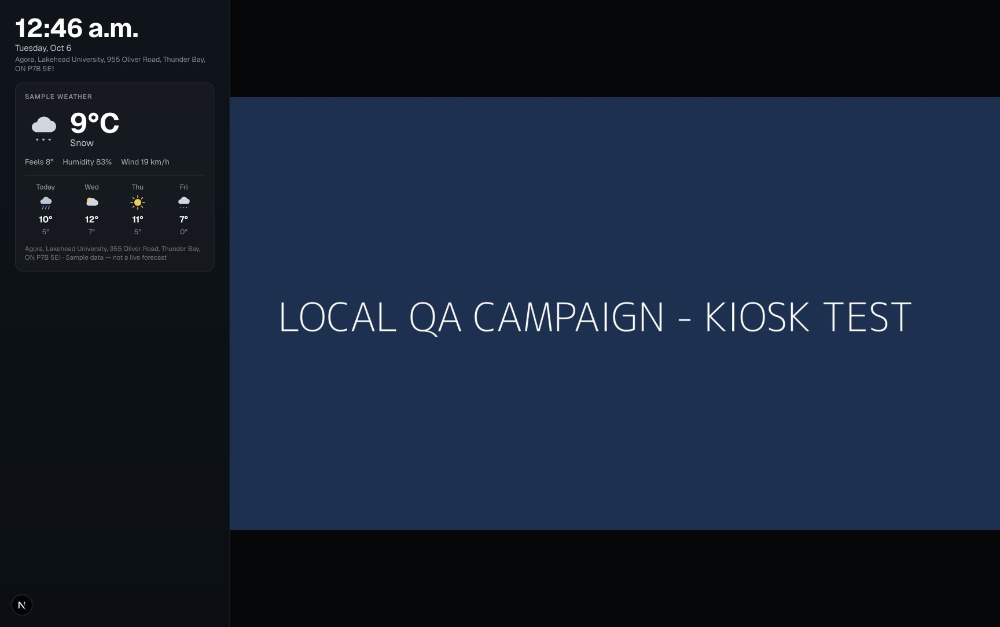
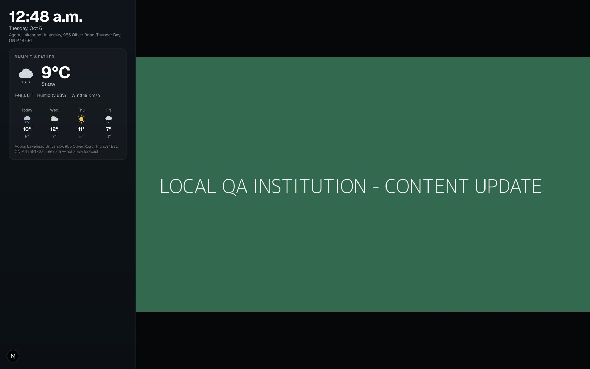

# Campaign and institution kiosk browser walkthrough — October 6, 2026

Completed through the running local app at `http://localhost:3001`, using the browser controls as a regular user. No unit tests, automated test runners, direct API calls, or database queries were used. Read-only source inspection helped interpret the approval and playback loop while navigating. The local app has payment collection disabled.

## Campaign creation and approval

- Signed in with the existing fictional Northline Fitness Marketing advertiser account.
- Selected **Lakehead University Agora Screen**, `INV-DEMO-INST-001`, from Find screens, and requested dates.
- Created **LOCAL QA — Chromium kiosk campaign 2026-10-06**, booking `BK-47B2D24745A7`, running October 6–20, 2026 with one showing per cycle.
- Selected Upload media in Creative Studio and uploaded a harmless 1920 × 1080 PNG from [DummyImage](https://dummyimage.com/1920x1080/183153/ffffff.png&text=LOCAL+QA+CAMPAIGN+-+KIOSK+TEST). It reads “LOCAL QA CAMPAIGN - KIOSK TEST” on a blue background.
- Submitted it for review and confirmed Creative review / Pending review in Your campaigns. Creative ID: `CRV-5424F358BFD7`.
- Signed out and signed in through the institution login as the existing Lakehead University Campus Media owner.
- Approved this campaign in Approvals. The audit trail recorded `creative review` → `approved` by the institution owner.

An initial date-entry attempt created the same-named request with the default future dates (`BK-1AEC203C9037`). That request was cancelled through the UI before artwork submission. Native keyboard input committed today's date for the successful request; its persisted date range was verified in both the submission and approval pages.

## Kiosk playback

- Created a one-time pairing code for Agora through Command centre.
- Used `http://127.0.0.1:3001/player?kiosk=1` for a separate local player origin. The existing `localhost` player pairing belonged to City Hall and was left untouched.
- Paired Agora, entered fullscreen with the kiosk button, and visually verified the approved blue campaign image. It was legible, retained its aspect ratio, and fit the configured weather layout without cropping the image's text.
- Confirmed Screen wake lock active and that the kiosk controls hide after use.
- Reloaded the kiosk and confirmed that pairing and the campaign image persisted.

## Institution content update

- With the institution owner still signed in, selected Publish content for Agora.
- Uploaded a second harmless 1920 × 1080 [DummyImage PNG](https://dummyimage.com/1920x1080/176b4d/ffffff.png&text=LOCAL+QA+INSTITUTION+-+CONTENT+UPDATE), titled **LOCAL QA — Institution kiosk update 2026-10-06**. The image reads “LOCAL QA INSTITUTION - CONTENT UPDATE” on a green background.
- Confirmed that the resource entered Screen content as Approved immediately, without an approval queue. Media ID: `MED-MUW75OD9`.
- Visually observed the green notice appear automatically in the same paired kiosk before reloading or re-pairing it.
- Subsequently reloaded the kiosk, entered fullscreen, and captured the notice in the rotation. The rendered image decoded at 1920 × 1080 and retained its aspect ratio with legible, uncropped text.
- Refreshed Player connection through the UI: Connected; published revision **2**; received / prepared / applied **2 / 2 / 2**; last applied **12:47:00 a.m.**; last contact **12:48:17 a.m.**; last playback **12:48:15 a.m.**; last player error **None reported** (local displayed times).

## Scope and resulting local state

The two requested content workflows passed in the local Chromium-based browser on macOS, using the app's kiosk mode. Physical Android and Windows devices, OS lockdown, unattended startup, and an offline run were not exercised in this walkthrough.

The approved dummy campaign, approved institution notice, and Agora player pairing remain available locally for inspection. Existing screen publication and prior content were preserved. The cancelled initial request remains as local history. No account was created, credentials changed, payment made, or site deployed. The local development server remains running on port 3001.
